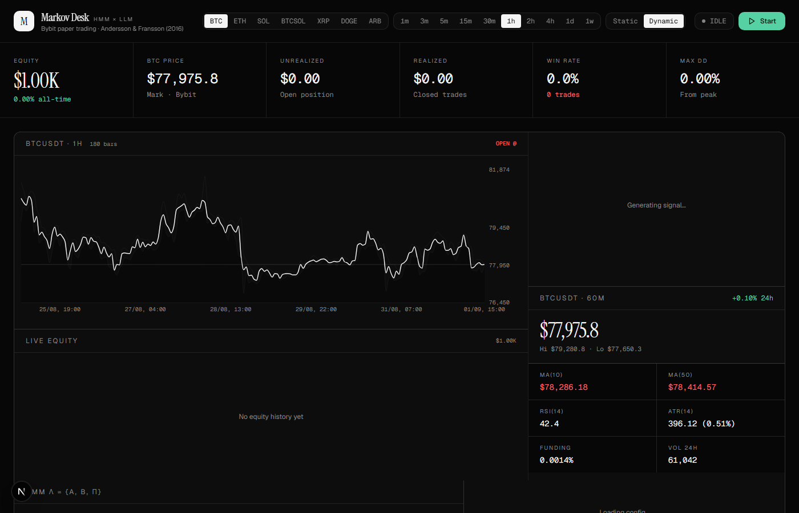

# Markov Desk

 — HMM × LLM Trading Bot for Bybit

Algorithmic paper-trading bot combining **Hidden Markov Models** (Baum-Welch + Viterbi, based on Andersson & Fransson 2016, University of Gothenburg) with an **LLM decision overlay** that learns from past trades via memory + reflection.

## Quick Start

```bash
# 1. Install dependencies
bun install
# or: npm install

# 2. Set up environment
cp .env.example .env
# Edit .env — add DeepSeek/Nemotron/OpenAI key if you want (optional, GLM works by default)

# 3. Initialize database
bun run db:push
# or: npx prisma db push

# 4. Start the bot
bun run dev
# or: npm run dev
```

Open http://localhost:3000

## What's Inside

### Core Engine
- **HMM** (`src/lib/hmm.ts`) — Baum-Welch training, Viterbi decoding, 2 hidden states (RISE/DROP), 9 observable states (Price movement x Mean displacement vs MA10)
- **Bybit client** (`src/lib/bybit.ts`) — public API, klines, ticker, synthetic cross-rates (BTCSOL = BTC/SOL)
- **LLM provider** (`src/lib/llm-provider.ts`) — GLM (default), DeepSeek, Nemotron, OpenAI, OpenRouter with rate limiting + dedup
- **Strategy engine** (`src/lib/strategy.ts`) — multi-symbol portfolio, position management, risk gates

### Learning System (3 layers)
- **Trade Memory** (`src/lib/memory.ts`) — every closed trade saved with 8-dim feature signature; cosine similarity search finds top-K similar past setups before each LLM decision
- **Reflection loop** (`src/lib/reflection.ts`) — every N closed trades, LLM reviews history and emits structured lessons (PATTERN/RISK/TIMING/OVERRIDE/CONFIRMATION)
- **Strategy Notes** — lessons persisted in DB, injected into future LLM prompts

### Dashboard
Minimalist 2026 design with Geist Variable + Geist Mono + Instrument Serif fonts. All panels connected in a single continuous border.

## LLM Usage (token-efficient)

The LLM is **decisive, not always-listening**. It's called only when:
1. HMM is uncertain (probability in 0.45-0.72 band)
2. Signal flipped while position is open (close/hold decision)

LLM is **skipped** when:
- HMM is confident (>0.72) -> follow HMM
- Position aligns with signal -> hold
- Already cached for this bar (5min TTL)

This keeps token usage minimal — typically 0-4 LLM calls per hour with 4 symbols on 1h interval.

## Switching LLM Provider

In the dashboard -> Config panel, click: glm / deepseek / nemotron / openai / openrouter

Set the corresponding API key in .env:
- DEEPSEEK_API_KEY — https://platform.deepseek.com/api_keys
- NEMOTRON_API_KEY — https://build.nvidia.com/ (free tier)
- OPENAI_API_KEY — https://platform.openai.com/api-keys
- OPENROUTER_API_KEY — https://openrouter.ai/keys

## Portfolio Symbols

Default: BTCUSDT,ETHUSDT,SOLUSDT,BTCSOL

- BTCUSDT, ETHUSDT, SOLUSDT — real Bybit linear pairs
- BTCSOL — synthetic cross-rate (BTC/SOL) computed from BTCUSDT and SOLUSDT

## Running 24/7 on Windows

See download/WINDOWS-DEPLOYMENT.md for detailed guide.

## Tech Stack

- Next.js 16 (App Router, Turbopack)
- TypeScript 5
- Tailwind CSS 4 + shadcn/ui
- Prisma ORM + SQLite
- Recharts for visualizations
- z-ai-web-dev-sdk (GLM, default)
- Framer Motion for animations

## Reference

Andersson, J. C., & Fransson, L. (2016). Algorithmic Trading Based on Hidden Markov Models. Bachelor's Thesis, University of Gothenburg, Sweden.

## License

MIT — for educational purposes. Paper trading only. Not financial advice.
